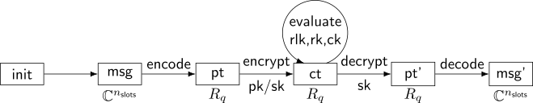
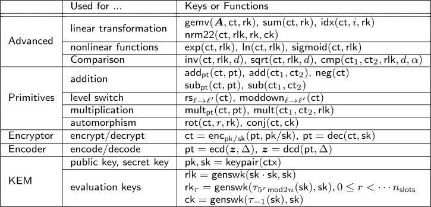

# GPQHE

A C library doing fully homomorphic encryption under the license of LGPL.

## Architecture

The architecture of a typical RLWE (that utilizing RNS in polynomial arithmetics)


The standard HE workflow:



The supported algorithms in GPQHE:



*MPI-RNS conversion*

## Package dependency

libgcrypt 1.10. This library is used in Linux kernel, and we utilize its mpi (multi-precision integer) module in GPQHE. If your system does not have it, do `sudo apt install libgcrypt11-dev`.

## How to use

```sh
# step 1: get GPQHE and build
git clone https://github.com/OChicken/GPQHE.git
cd GPQHE
git submodule init
git submodule update
mkdir -p lib
make

# step 2: run tests
cd tests
LD_LIBRARY_PATH=$PWD/../lib:$LD_LIBRARY_PATH
make test-gpqhe
./test-gpqhe enc sk
./test-gpqhe mul pk
```

## Remarks

1. For KAT (known answer tests), we use compiler option `-DSUPERCOP` in `src/Makefile` to deterministic generate random numbers. To fully support true rng, change it to `-DRANDOM`.

2. `tests/polymul.gp` is a [PARI/GP](https://pari.math.u-bordeaux.fr/) script file to verify correctness of polynomial multiplication.

## Acknowledgement

This library is developed upon [HEAAN](https://github.com/snucrypto/HEAAN), [NewHope](https://newhopecrypto.org/) and [Kyber](https://pq-crystals.org/kyber/). We show gratefulness to the developers.
